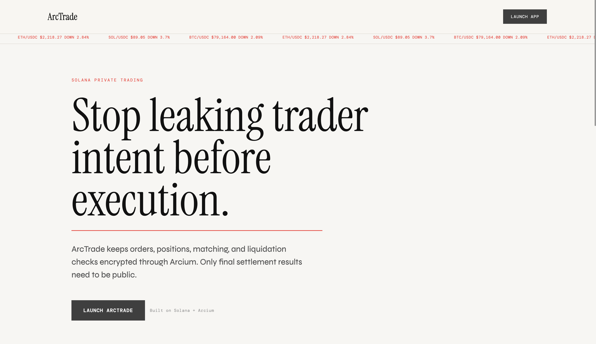

# ArcTrade - Private Trading Built on Arcium MPC

ArcTrade is a decentralized, privacy-preserving trading terminal built on Solana. It uses the **Arcium MPC network** to demonstrate encrypted trader intent, private order submission, and offchain confidential computation definitions.

By encrypting trader intent such as size, side, and entry price before it reaches public state, ArcTrade reduces the information available to copy-traders, front-runners, and liquidation hunters.



## Features
- **Private Order Submission:** Order data is encrypted client-side and submitted through a Solana instruction that queues Arcium computation.
- **Arcium Offchain Circuits:** Computation definitions point to public GitHub-hosted `.arcis` artifacts with hash verification.
- **Open Order Visibility:** Submitted private orders appear as open orders while the sensitive trade fields remain encrypted.
- **Demo Settlement Flow:** Matching and PnL settlement are represented as a simulation layer in the current demo.
- **Trading Terminal UI:** A polished Vercel-deployed interface for wallet connection, account initialization, private order entry, and order review.

## Arcium Integration
ArcTrade uses Arcium as the privacy layer for the trading engine. The project is split into two main parts:

- `encrypted-ixs/circuits/private_trading.rs` defines the confidential Arcis computations for private order validation, matching, liquidation checks, settlement, cancellation, and position updates.
- `programs/private_trading` is the Anchor/Solana state and settlement layer. It stores encrypted order and position blobs, records pending computation references, queues Arcium computations, and exposes callback-style settlement paths that reveal only final public outputs such as realized PnL and liquidation status.

The implemented private order flow is:

1. Users pack and encrypt trade parameters client-side, including side, size, price, position, collateral, and liquidation inputs.
2. The Solana program stores encrypted order data or commitments rather than plaintext trader intent.
3. The `place_order_private` instruction calls Arcium `queue_computation(...)` for the `place_order` Arcis circuit.
4. Arcium receives the encrypted arguments and uses the registered offchain circuit definition for private computation.
5. The order appears in the open-order view without exposing the underlying private order fields.

Matching, liquidation checks, and final settlement callbacks are included as circuit/program structure, but the live demo currently treats matching and PnL as a simulation layer rather than a production settlement engine.

```text
User → Encrypted Order → Solana Order Account → Arcium Queue → Open Order / Demo Settlement
```

### Privacy Benefits

Public perpetuals and order-book systems leak trader intent before execution. Visible order size, side, entry price, and liquidation thresholds can enable copy-trading, front-running, sandwiching, and targeted liquidations. ArcTrade reduces this leakage by keeping the sensitive inputs encrypted through the trading workflow and revealing only the minimum final state needed for settlement.

In the current demo, the strongest live privacy guarantee is around private order submission: order size, direction, price, timestamp, and collateral inputs are encrypted before the Arcium queue instruction is sent. The settlement UI is intentionally demo-stage.

### What to Review

- Confidential trading logic: `encrypted-ixs/circuits/private_trading.rs`
- Solana program entrypoints: `programs/private_trading/src/lib.rs`
- Real Arcium computation-definition setup: `programs/private_trading/src/instructions/arcium_comp_defs.rs`
- Queue-based private order entrypoint: `programs/private_trading/src/instructions/place_order.rs`
- Offchain circuit artifacts for Arcium nodes: `build/*.arcis`
- Encrypted state and callback tracking: `programs/private_trading/src/state/mod.rs`
- Arcium account validation and computation references: `programs/private_trading/src/instructions/common.rs`
- Callback-style final settlement: `programs/private_trading/src/instructions/callback.rs`

### Current Demo Scope

What is live:

- Devnet Solana program deployment.
- Arcium `0.9.7` integration.
- Public GitHub-hosted offchain circuit artifacts.
- Initialized Arcium computation definitions.
- Private order encryption in the frontend.
- `place_order_private` calling Arcium `queue_computation(...)`.
- Open-order display after submission.

What is demo-stage:

- Order matching.
- PnL calculation.
- Final settlement visibility.
- Position accounting after match.

The Match action in the UI is a demonstration of the intended settlement experience, not a production-grade matching engine.

### Offchain Circuit Definitions

ArcTrade uses Arcium `0.9.7` and initializes computation definitions with offchain circuit sources. The compiled `.arcis` files are stored in the repository under `build/` so Arcium nodes can fetch them through public GitHub raw URLs instead of requiring expensive on-chain bytecode uploads. Each offchain source is paired with the generated `circuit_hash!` value, so nodes can verify that the downloaded circuit matches the compiled artifact.

When rebuilding circuits, use:

```bash
arcium build --skip-keys-sync
```

Then push the generated `build/*.arcis`, `build/*.hash`, `build/*.idarc`, and `build/*.weight` files. After deployment, initialize the computation definitions once by calling the `init_*_comp_def` instructions exposed by the Anchor program.

The frontend's full-privacy order path uses `@arcium-hq/client` to fetch the MXE public key, encrypt typed order fields with `RescueCipher`, derive the Arcium queue accounts, and call `place_order_private`. Non-full privacy mode remains available as a compatibility fallback.

## 🎮 Live Demo
Try ArcTrade on Devnet: [https://arctrades.vercel.app](https://arctrades.vercel.app)

## Verification

- Devnet program: `e6oyALFfDbVMy4gp3xVr5hRXo5VyCSw23gxk9M3YALM`
- Live app: [https://arctrades.vercel.app](https://arctrades.vercel.app)
- Arcium version: `0.9.7`
- Private order entrypoint: `place_order_private`
- Arcium queue call: `programs/private_trading/src/instructions/place_order.rs`
- Computation-definition init: `programs/private_trading/src/instructions/arcium_comp_defs.rs`
- Offchain circuit artifacts: `build/*.arcis`, `build/*.hash`, `build/*.idarc`, `build/*.weight`

Build checks:

```bash
anchor build
cd frontend
npm run build
```


## 🛠️ Built With
- **Frontend**: React, Vite, TypeScript
- **Smart Contracts**: Anchor, Rust
- **Privacy**: Arcium MPC Network
- **Styling**: CSS Variables, Neon Cyber theme
- **APIs**: Jupiter Price API, TradingView

## Getting Started

### Prerequisites
- Node.js (v18+)
- Solana CLI
- Anchor CLI (v0.32.1)

### Running the Frontend
```bash
cd frontend
npm install
npm run dev
```

### Running the Smart Contracts
Ensure your Solana cluster is set to `devnet`.
```bash
anchor build
anchor test
```
